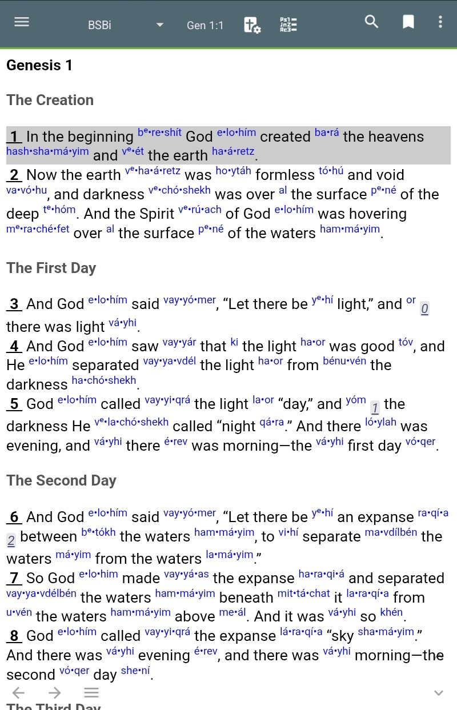
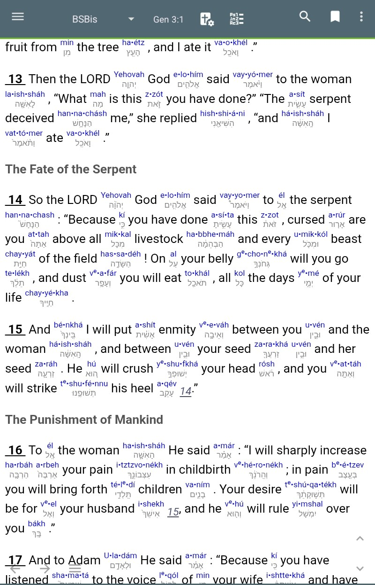
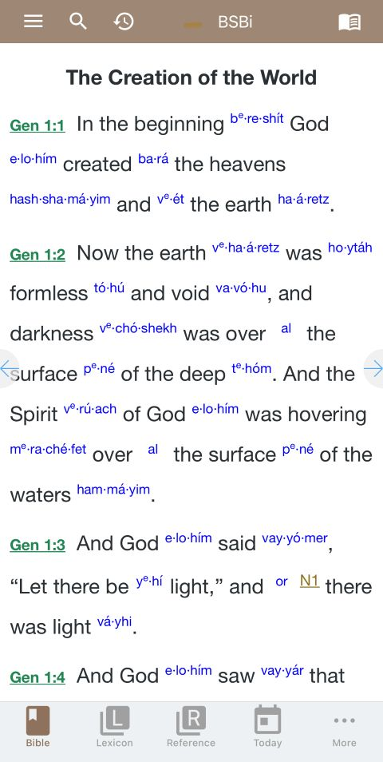

# BSB Intralinear Bible — Installation Guide

The BSB Intralinear Bible combines the **Berean Standard Bible** with inline Hebrew and Greek transliteration linked to Strong's concordance. It is available for two Bible apps:

- **MySword** — Android phones and tablets
- **e-Sword** — Android and iOS phones and tablets

---

## MySword (Android)

The MySword application has more features and is more polished and configurable than e-Sword. However, it is only available for Android and can not be installed from the Play Store.
The application is free, but requires a $25 "donation" to unlock all features.
 

### Step 1 — Install MySword

1. [Download](https://www.mysword.info/download-mysword) the application your Android device.
2. Click on the downloaded APK package to install it.
3. Open MySword and complete any first-run setup. Click on "Download Modules" and choose from hundreds of Bible translations, commentaries, books and devotionals.
4. Install at least one Hebrew and Greek dictionary so dictionary links can load (i.e. the combined BDB/Thayer)

### Step 2 — Download the Intralinear Module

1. On your device, open this link to download the module:
   **[BSBi.bbl_1-0-0.zip](https://github.com/scottrbailey/intralinear-bible/releases/download/v1.0.0/BSBi.bbl_1-0-0.zip)** BSB Intralinear or **[BSBis.bbl_1-0-0.zip](https://github.com/scottrbailey/intralinear-bible/releases/download/v1.0.0/BSBis.bbl_1-0-0.zip)** BSB Intralinear Stacked
2. When prompted, save the file to your device's **Downloads** folder.

### Step 3 — Install the Module

1. Open a file manager app on your device (e.g. **Files by Google**).
2. Move to Internal Storage > mysword folder.  
3. There is no need to unzip or copy to the mysword / bibles folder, MySword will do this for you automatically when you restart.

### Choosing Between Standard and Stacked

**Standard (`BSBi`)** — transliteration appears as a superscript after the English word. Tap it to open the Strong's lexicon entry.

**Stacked (`BSBis`)** — transliteration and original Hebrew, Aramaic or Greek are stacked vertically beside the English word.

---

## e-Sword (Android and iOS)
The e-Sword app is not as full-featured as MySword and there are not as many modules available for it. But it is still quite capable, and on iOS, it is your only option. 

### Step 1 — Install e-Sword

**Android:**
1. Open the **Google Play Store**.
2. Search for **[e-Sword Bible](https://play.google.com/store/apps/details?id=net.esword.esword&hl=en_US)** and install it. Cost is $2.99.

**iOS (iPhone/iPad):**
1. Open the **App Store**.
2. Search for **[e-Sword](https://apps.apple.com/us/app/e-sword-lt-bible-study-to-go/id634158738)**  and install it.  Cost is $3.99.
3. Open e-Sword and complete any first-run setup.
4. Download > Lexicons - and install at least one for Hebrew and Greek. Be sure to check out the available Bibles, commentaries, books and devtionals.   

### Step 2 — Download the Module

1. On your device, open this link to download the module:
   **[BSBi_1-0-0.zip](https://github.com/scottrbailey/intralinear-bible/releases/download/v1.0.0/BSBi_1-0-0.zip)**
2. Save the file to your device's **Downloads** folder.

### Step 3 — Install the Module 

1. Open a file manager app on your device.
2. Navigate to your **Downloads** folder and extract the `BSBi_1-0-0.zip` file.
3. You should see a file named `BSBi.bbli`.
4. Open e-Sword and click General > Import. Navigate to your Downloads folder, select the `BSBi.bbli` file and click `Open` to import the module.

---

## Features

- **Transliteration** — Hebrew and Greek words are shown in Latin script so you can pronounce them without knowing the original alphabets.
- **Strong's Links** — tap any transliteration to open the corresponding Strong's lexicon entry explaining the word's meaning and usage.
- **Translator Notes** — footnotes from the BSB translation team are included and accessible by tapping the note markers.
- **Cross-References** — Treasury of Scripture Knowledge (TSK) cross-references are included (e-Sword only). MySword has a standalone TSK module.
- **Section Headers** — optional section headings from the BSB are included and can be toggled in app settings.

---

## Troubleshooting

**The module doesn't appear after installation.**
Restart the app. If it still doesn't appear, verify the file is in the correct folder and has the correct extension (`.bbl.mybible` for MySword, `.bbli` for e-Sword).

**Tapping a transliteration doesn't open the lexicon.**
Make sure you have a Hebrew and Greek dictionary/lexicon installed in the app. Start "Brown-Driver-Briggs' Hebrew Definitions" and "Thayer's Greek Definitions."
