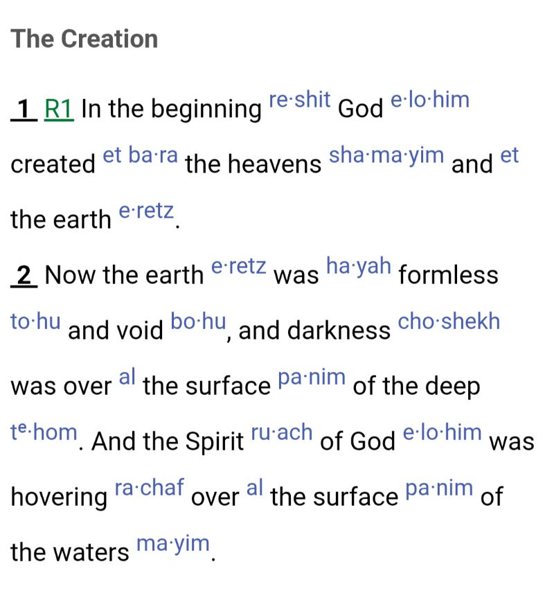
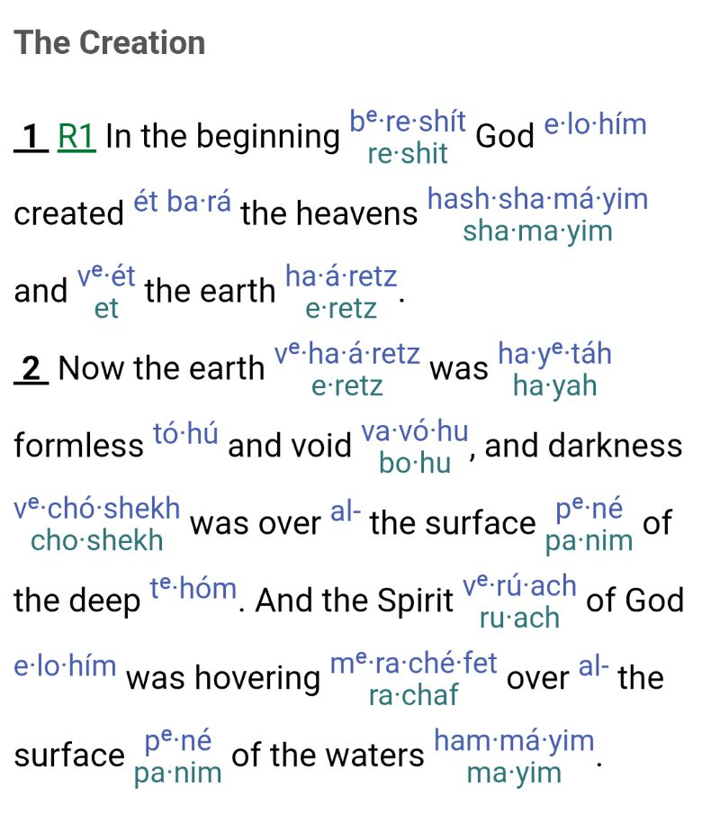
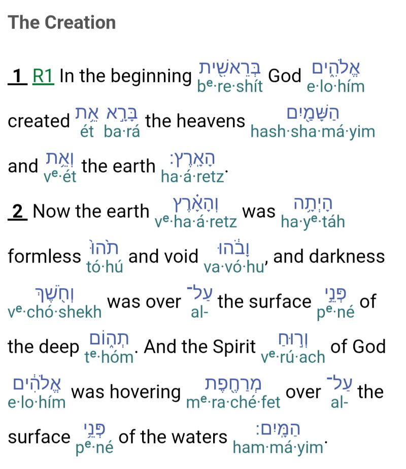
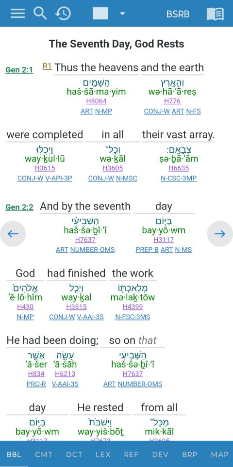
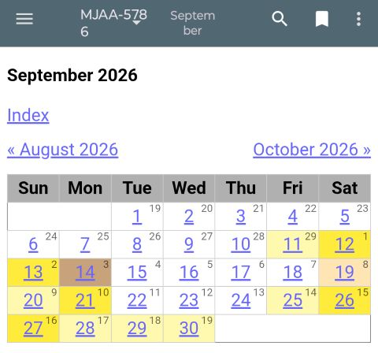
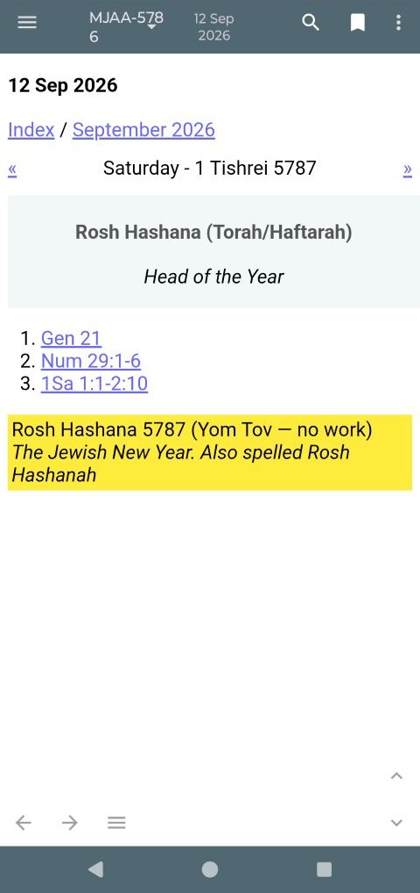

# Berean Transliterated Bible — Installation Guide

The Berean Transliterated Bible combines the **Berean Standard Bible** with inline Hebrew and Greek transliteration linked to Strong's lexicon. 
The module also includes translator notes, cross-references, and words of Christ in red (can be toggled off in the application).
It is available for two Bible apps:

- **[MySword](#mysword-android)** — Android phones and tablets
- **[e-Sword](#e-sword-android-and-ios)** — Android and iOS phones and tablets (does not play well with the desktop version of e-Sword)

---

### Choosing Between Transliteration Levels

Each word in the BTB series pairs the English translation with a line (or two) drawn from one of three kinds of source text:

1. **The original text** — the actual Hebrew, Aramaic, or Greek script as it appears in the source codices.
2. **A simple transliteration** — a non-academic rendering of that same source text, showing how the word actually appearing in that verse is pronounced.
3. **A transliteration of the lemma** — the word's dictionary form. The lemma doesn't necessarily match what's actually in the source text: Hebrew especially is heavily inflected with prefixes and suffixes that can make a word look very different from its dictionary form.

In any transliteration, a raised accent mark (´) shows which syllable to stress — e.g. "be·re·shít" is stressed on the last syllable.

Each level below uses one of these three as its _primary line_ — shown in blue, in the superscript position above the English word, and linked to the lexicon. Some levels also show a _helper line_, one step simpler than the primary line, in the subscript position beneath it.

**Berean Transliterated Bible - Level 1 (`BTB-L1`)** — the beginner-level module. The primary line is the transliteration of the lemma (the dictionary form of a word). This especially helps if you're just getting started with Hebrew, where prefixes, suffixes, and vowel changes can make a word look very different from the form you'd find in a dictionary. There is no helper line.

**Berean Transliterated Bible - Level 2 (`BTB-L2`)** — the intermediate-level module. The primary line is the transliteration of the source text. The helper line is the transliteration of the lemma. When the word is already in its dictionary form (the two transliterations match), the helper line is left blank rather than repeating the same text.

**Berean Transliterated Bible - Level 3 (`BTB-L3`)** — the advanced-level module. The primary line is the original source text. The helper line is the transliteration of that text.

**Berean Standard Reverse Interlinear Bible  (`BSRB`)** - full reverse (English -> Hebrew and Greek) interlinear with original Hebrew, Aramaic and Greek, academic transliteration, Strong's numbers and morphology codes. Tapping the Strong's number will open the word
in the lexicon. Tapping the morphology code will open the definition in the _Robinson's Morphology Analysis Codes_ dictionary if the RMAC module is installed. 

## MySword (Android)

The MySword application has more features and is more polished and configurable than e-Sword. However, it is only available for Android and cannot be installed from the Play Store, which makes it a bit more complicated to install.
The application is free, but requires a $25 "donation" to unlock some configuration features.
 

### Step 1 — Install MySword

1. [Download](https://www.mysword.info/download-mysword) the application to your Android device.
2. Tap on the downloaded APK package to install it.  You will likely need to go into settings to allow installing from a file. 
3. Open MySword and complete any first-run setup. Tap on "Download Modules" and choose from hundreds of Bible translations, commentaries, books and devotionals.
4. Install at least one Hebrew and Greek lexicon.  See [Lexicon](#lexicondictionary-suggestions) section below for suggestions.

### Step 2 — Download the Bible Module

1. On your device, open this link to download the module:
   - **[BTB-L1.bbl.zip](https://github.com/scottrbailey/intralinear-bible/releases/latest/download/BTB-L1.bbl.zip)** Berean Transliterated Bible - Level 1 
   - **[BTB-L2.bbl.zip](https://github.com/scottrbailey/intralinear-bible/releases/latest/download/BTB-L2.bbl.zip)** Berean Transliterated Bible - Level 2 
   - **[BTB-L3.bbl.zip](https://github.com/scottrbailey/intralinear-bible/releases/latest/download/BTB-L3.bbl.zip)** Berean Transliterated Bible - Level 3
   - **[BSRB.bbl.zip](https://github.com/scottrbailey/intralinear-bible/releases/latest/download/BSRB.bbl.zip)** Berean Standard Reverse Interlinear Bible
2. When prompted, save the file to your device's **Downloads** folder.

### Step 3 — Install the Module

1. Open a file manager app on your device (e.g. **Files by Google**).
2. Move to `Internal Storage` > `mysword` folder (not the `mysword/bibles` folder).  
3. There is no need to unzip, MySword will do this for you automatically.
4. Restart the MySword app

---

## e-Sword (Android and iOS)

e-Sword is one of the original free Bible study tools with an ecosystem of thousands of downloadable modules and versions targeting Windows, macOS, Android and iOS phones and tablets.
If you want to use the transliterated Bible on iOS, this is your only choice.

### Step 1 — Install e-Sword

**Android:**
1. Open the **Google Play Store**.
2. Search for **[e-Sword Bible](https://play.google.com/store/apps/details?id=net.esword.esword&hl=en_US)** and install it. Cost is $2.99.

**iOS (iPhone/iPad):**
1. Open the **App Store**.
2. Search for **[e-Sword](https://apps.apple.com/us/app/e-sword-lt-bible-study-to-go/id634158738)**  and install it.  Cost is $3.99.
3. Open e-Sword and complete any first-run setup.
4. Download > Lexicons - and install at least one for Hebrew and Greek (see [lexicon](#lexicondictionary-suggestions) section below for suggestions). Be sure to check out the available Bibles, commentaries, books and devotionals.   

### Step 2 — Download the Module

1. On your device, open this link to download the module:
   - **[BTB-L1.zip](https://github.com/scottrbailey/intralinear-bible/releases/latest/download/BTB-L1.zip)** Berean Transliterated Bible - Level 1
   - **[BTB-L2.zip](https://github.com/scottrbailey/intralinear-bible/releases/latest/download/BTB-L2.zip)** Berean Transliterated Bible - Level 2
   - **[BTB-L3.zip](https://github.com/scottrbailey/intralinear-bible/releases/latest/download/BTB-L3.zip)** Berean Transliterated Bible - Level 3
   - **[BSRB.zip](https://github.com/scottrbailey/intralinear-bible/releases/latest/download/BSRB.zip)** - Berean Standard Reverse Interlinear Bible + RMAC (morphology) dictionary

2. Save the file to your device's **Downloads** folder.

### Step 3 — Install the Module 

1. Open a file manager app on your device.
2. Navigate to your **Downloads** folder and extract the `BTB-L1.zip`, `BTB-L2.zip`, `BTB-L3.zip`, `BSRB.zip` file.
3. You should see a file named `BTB-L1.bbli`, `BTB-L2.bbli`, `BTB-L3.bbli`, or `BSRB.bbli` (and `rmac.dcti` RMAC dictionary)
4. Open e-Sword and tap General > Import. Navigate to your Downloads folder, select the unzipped file and click `Open` to import the module. When selecting files to import, you can long press to select and install multiple modules at a time.

---

## Features

- **Transliteration** — Hebrew and Greek words are shown in Latin script so you can pronounce them without knowing the original alphabets. As the target audience for the Transliterated Bible is not seminarians and Bible academics, a simple transliteration scheme with syllable separators and stress markers was chosen. If you want academic or phonetic transliterations, you can select a different transliteration scheme in the config.yaml file.
- **Hebrew and Greek** — The BSB-L3 version has the original Hebrew, Aramaic and Greek text over the transliteration.  
- **Strong's Links** — Tap any transliteration to open the corresponding Strong's lexicon entry explaining the word's meaning and usage.
- **Translator Notes** — Footnotes from the BSB translation team are included and accessible by tapping the note markers.
- **Cross-References** — The BSB translator cross-references are included.
- **Section Headers** — Because e-Sword uses their own section headers by default (called pericopes), the headers from the BSB were not included by default. 
- **Configurable** — To change the transliteration scheme, section headers or cross-references, clone this repository, change the config.yaml file and compile your own modules using the directions in [DEVELOPMENT.md](DEVELOPMENT.md)

---

## Lexicon/Dictionary Suggestions

Tapping on any of the transliterated words will take you to the lexicon entry for that word.  Which lexicon it takes you to is configurable by you. But first you need to download one or more lexicons. 
MySword refers to lexicons as "dictionaries", while e-Sword separates "lexicons" (keyed by Strong's numbers) and "dictionaries" (keyed by words like Oxford or Merriam-Webster).
Most lexicons are for a single language. But both applications offer a combined Hebrew/Greek lexicon as either "Strongs", "Strongs Lite" or "BDB-Thayer".

### AHLB - Ancient Hebrew Lexicon of the Bible
If you want a much richer understanding of the Hebrew language, we highly recommend the [Ancient Hebrew Lexicon of the Bible](https://www.ancient-hebrew.org/ahlb/). It shows the ancient Hebrew pictographs (Paleo Hebrew script) and explains how those pictures form concrete root words and how additional words are built off of that root that share a common theme.

To get the most out of the AHLB, you will need to read the introduction. On e-Sword, the AHLB introduction is available as a "Reference" book once you install the Lexicon. On MySword, the introduction is in the lexicon under the entries "01" through "16", linked at the bottom of every entry.
Installing the AHLB lexicon on e-Sword will make the book's introduction available under the "Reference" section. 
There is also a short YouTube [introduction video](https://www.youtube.com/watch?v=wc1pV8E3L_Q) if you can't find the intro in your Bible app.

---

## Weekly Torah Portions - Bible in a Hebrew Year 
A daily devotional based on the [Messianic Jewish Association of America's](https://mjaa.org/bible-in-a-year/) Bible reading plan.
- Friday/Saturday weekly Torah/Haftarah readings
- Sunday/Thursday Bible in a (Hebrew) year readings
- Includes information on major and minor holidays, new moons and fast days
- MySword version includes an interactive calendar with both Gregorian and Hebrew dates
- 5786 Reading Plan downloads:
  - **[mjaa-5786.bok.mybible](https://github.com/scottrbailey/intralinear-bible/releases/latest/download/mjaa-5786.bok.mybible)** MySword Devotional + Calendar (available under Books)
  - **[mjaa-5786.refi](https://github.com/scottrbailey/intralinear-bible/releases/latest/download/mjaa-5786.refi)**  e-Sword Devotional + Calendar (available under "Reference")
  - **[mjaa-5786.devi](https://github.com/scottrbailey/intralinear-bible/releases/latest/download/mjaa-5786.devi)**  e-Sword Devotional (available under "Devotional" or "Today")

---

## Troubleshooting

**The module doesn't appear after installation.**
Restart the app. If it still doesn't appear, verify the file is in the correct folder and has the correct extension (`.bbl.mybible` for MySword, `.bbli` for e-Sword).

**Tapping a transliteration doesn't open the lexicon.**
Make sure you have a Hebrew and Greek dictionary/lexicon installed in the app. Both MySword and e-Sword will allow you to configure which lexicon to use for Hebrew and Greek.

