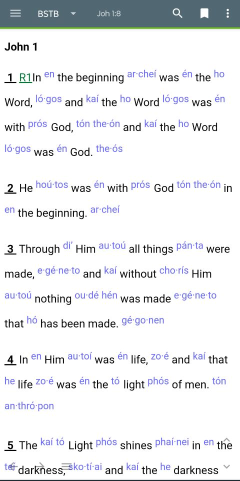
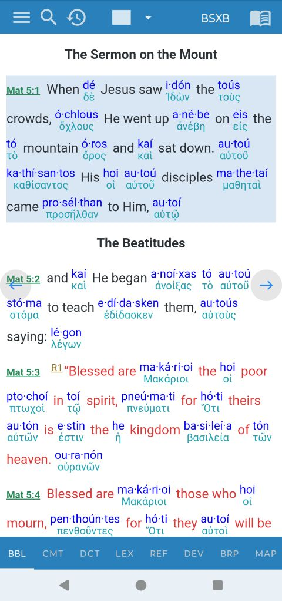

# Berean Standard Transliterated Bible — Installation Guide

The Berean Standard Transliterated Bible combines the **Berean Standard Bible** with inline Hebrew and Greek transliteration linked to Strong's concordance. 
The module also includes translator notes, cross references, and words of Christ in red (can be toggled off in application).
It is available for two Bible apps:

- **[MySword](#mysword-android)** — Android phones and tablets
- **[e-Sword](#e-sword-android-and-ios)** — Android and iOS phones and tablets (does not play well with desktop version of e-Sword)

---

### Choosing Between Transliterated and Translinear

**Standard (`BSTB`)** — transliteration appears as a superscript after the English word. Clicking the transliterations will open the dictionary entry in whichever lexicon module you have configured.

**Stacked (`BSXB`)** — transliteration and original Hebrew, Aramaic or Greek are stacked vertically beside the English word. The transliterations are links to the lexicon.

## MySword (Android)

The MySword application has more features and is more polished and configurable than e-Sword. However, it is only available for Android and can not be installed from the Play Store, which makes it a bit more complicated to install.
The application is free, but requires a $25 "donation" to unlock all features.
 

### Step 1 — Install MySword

1. [Download](https://www.mysword.info/download-mysword) the application your Android device.
2. Click on the downloaded APK package to install it. 
3. Open MySword and complete any first-run setup. Click on "Download Modules" and choose from hundreds of Bible translations, commentaries, books and devotionals.
4. Install at least one Hebrew and Greek lexicon.  See [Lexicon](#lexicondictionary-suggestions) section below for suggestions.

### Step 2 — Download the BSTB/BSXB Module

1. On your device, open this link to download the module:
   **[BSTB.bbl.zip](https://github.com/scottrbailey/intralinear-bible/releases/latest/download/BSTB.bbl.zip)** Berean Standard Transliterated Bible 
   or **[BSXB.bbl.zip](https://github.com/scottrbailey/intralinear-bible/releases/latest/download/BSXB.bbl.zip)** Berean Standard Translinear Bible 
2. When prompted, save the file to your device's **Downloads** folder.

### Step 3 — Install the Module

1. Open a file manager app on your device (e.g. **Files by Google**).
2. Move to Internal Storage > mysword folder.  
3. There is no need to unzip or copy to the mysword / bibles folder, MySword will do this for you automatically when you restart.
4. Restart the MySword app

---

## e-Sword (Android and iOS)
e-Sword is one of the original free Bible study tools with an ecosystem of thousands of downloadable modules and versions targeting Windows, MacOS, Android and iOS phones and tablets.
If you want to use the transliterated Bible on iOS, this is your only choice.

### Step 1 — Install e-Sword

**Android:**
1. Open the **Google Play Store**.
2. Search for **[e-Sword Bible](https://play.google.com/store/apps/details?id=net.esword.esword&hl=en_US)** and install it. Cost is $2.99.

**iOS (iPhone/iPad):**
1. Open the **App Store**.
2. Search for **[e-Sword](https://apps.apple.com/us/app/e-sword-lt-bible-study-to-go/id634158738)**  and install it.  Cost is $3.99.
3. Open e-Sword and complete any first-run setup.
4. Download > Lexicons - and install at least one for Hebrew and Greek (see [lexicon](#lexicondictionary-suggestions) section below for suggestions.). Be sure to check out the available Bibles, commentaries, books and devotionals.   

### Step 2 — Download the Module

1. On your device, open this link to download the module:
   **[BSTB.zip](https://github.com/scottrbailey/intralinear-bible/releases/latest/download/BSTB.zip)** -  Berean Standard Transliterated Bible
   **[BSXB.zip](https://github.com/scottrbailey/intralinear-bible/releases/latest/download/BSXB.zip)** - Berean Standard Translinear Bible

2. Save the file to your device's **Downloads** folder.

### Step 3 — Install the Module 

1. Open a file manager app on your device.
2. Navigate to your **Downloads** folder and extract the `BSTB.zip` or `BSXB.zip` file.
3. You should see a file named `BSTB.bbli` or `BSXB.bbli`.
4. Open e-Sword and click General > Import. Navigate to your Downloads folder, select the `*.bbli` file and click `Open` to import the module.

---

## Features

- **Transliteration** — Hebrew and Greek words are shown in Latin script so you can pronounce them without knowing the original alphabets. As the target audience for the Transliterated/Translinear Bible is not seminarians and Bible academics, a simple transliteration scheme with syllable separators and stress markers was chosen. If you want academic or phonetic transliterations, you can select a different transliteration scheme in the config file.
- **Hebrew and Greek** — The Translinear version has the original Hebrew, Aramaic and Greek text below the transliteration.  
- **Strong's Links** — Tap any transliteration to open the corresponding Strong's lexicon entry explaining the word's meaning and usage.
- **Translator Notes** — Footnotes from the BSB translation team are included and accessible by tapping the note markers.
- **Cross-References** — BSB parallel-passage cross-references are available as separate modules in both e-Sword and MySword. They can be toggled on in the config file.
- **Section Headers** — Because e-Sword uses their own section headers by default (called pericopes), the headers from the BSB were not included by default. 
- **Configurable** — To change the transliteration scheme, include section headers or cross-references, clone this repository, change the config.yaml file, and download the sources from [Clear-Bible](https://github.com/Clear-Bible), see notes in [DEVELOPMENT.md](DEVELOPMENT.md)

---

## Lexicon/Dictionary Suggestions

Clicking on any of the transliterated words will take you to the lexicon entry for that word.  Which lexicon it takes you to is configurable by you. But first you need to download one or more lexicons. 
MySword refers to lexicons as "dictionaries", while e-Sword separates "lexicons" (keyed by Strong's numbers) and "dictionaries" (keyed by words like Oxford or Merriam-Webster).
Most lexicons are for a single language. Try [Brown-Driver-Briggs Hebrew and English Lexicon](https://en.wikipedia.org/wiki/Brown-Driver-Briggs) for Hebrew and [Thayer's Greek-English Lexicon](https://www.bible-discovery.com/dictionary-license-thayer) for Greek. MySword offers a combined "BDB/Thayer's" in one download. 
We also recommend the [Ancient Hebrew Lexicon of the Bible](https://www.ancient-hebrew.org/ahlb/), if you a much deeper understanding of the Hebrew language. Installing the AHLB lexicon on e-Sword will make the book's forward available under the "Reference" section. 
Reading the AHLB forward will help you understand the definitions.

---

## Troubleshooting

**The module doesn't appear after installation.**
Restart the app. If it still doesn't appear, verify the file is in the correct folder and has the correct extension (`.bbl.mybible` for MySword, `.bbli` for e-Sword).

**Tapping a transliteration doesn't open the lexicon.**
Make sure you have a Hebrew and Greek dictionary/lexicon installed in the app.
